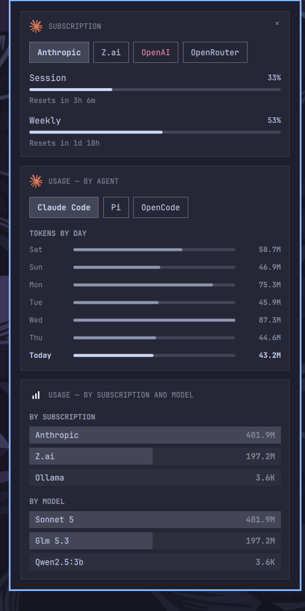

# Agents Monitor

An [Omarchy](https://omarchy.org) shell plugin: **Claude Code, Codex,
Fireworks, pi, OpenCode, Z.ai, and OpenRouter** usage, limits, and pace in
one bar panel.

Fork of the stock `omarchy.agents` widget (MIT) with built-in **pi agent**,
**OpenCode**, **Z.ai**, and **OpenRouter** collection — providers the stock
panel does not show. When installed it replaces the stock widget on the bar.



*The panel with the Z.ai subscription selected (quota meters) and the
Claude Code agent below (day/model charts, per-subscription attribution).*


## What it adds over stock

| Provider | Limits | Local stats |
|---|---|---|
| claude | Anthropic OAuth usage endpoint | as stock |
| codex | Codex app-server RPC | as stock |
| fireworks | prepaid balance estimate | as stock |
| **pi** | — (local stats only) | `~/.pi/agent/sessions` + `~/.omp/agent/sessions` transcripts, every provider **except** `anthropic` and `openai-codex` (those are already folded into the Claude/Codex tabs by the stock collectors; counting them here would double-count) |
| **opencode** | — (local stats only) | `~/.local/share/opencode/opencode.db` (SQLite, read-only) — every assistant message, all providers; the stock collectors never scan OpenCode's store, so nothing needs excluding |
| **zai** | GLM Coding Plan quota (undocumented community endpoint `api/monitor/usage/quota/limit`, keyed from OpenCode's `auth.json`): 5-hour + weekly token windows, tool-request quota, plan level; fail-soft with a cached-payload fallback | — (account-level quota, no local store of its own) |
| **openrouter** | pay-as-you-go credits (official `/api/v1/credits` + `/api/v1/auth/key`): one "Credits used" meter, balance line — credits do not reset | token stats via the Analytics API (`/api/v1/analytics/query`, management key required; balance-only without it), plus a CREDIT BURN BY APP breakdown on the service card (`app` dimension, same management key) |
| **hermes** | — (local stats only; it burns other subscriptions) | `~/.hermes/state.db` (SQLite, read-only) — `session_model_usage` rows by model and billing provider, attributed to the session's start day; hermes riding the Codex subscription (`billing_provider: openai-codex`) shows up on the OpenAI service tab's use-ranking and in the USAGE — BY SUBSCRIPTION AND MODEL card |
| **copilot** | — (activity only: copilot 1.0.83 persists no token counts — `session-store.db`'s `assistant_usage_events` is empty, upgrade path documented in the collector) | `~/.copilot/session-store.db` (SQLite, read-only) — prompts are turns with a user message, sessions are sessions that ran a turn, day buckets from turn timestamps; no token claims, so charts stay hidden rather than lie |
| **discovery** | — | the catalog-driven detection layer: parses Omarchy's agent catalog at runtime (`omarchy-menu.jsonc`, vendored fallback), applies `omarchy-default-agent`'s installed-semantics (on-demand mise stubs are NOT installs), probes stores, and writes MVP activity records for used agents without a collector. Agent tabs are earned by use in the last 7 days — activity-only records (and agents idle for a week) stay maintained in the usage dir but out of the strip. Also writes its own `discovery.json` every run, carrying `installedUnused` — catalog agents installed here but never used and owned by no collector — which the AGENT card shows as a dim footer line instead of a tab |

Everything else — the per-day and per-model charts, cross-device
sync, settings schema — is the stock widget, unchanged. The QML
divergences: the panel content is a three-card, two-strip design (split
from two cards into three 2026-09-18) — a SUBSCRIPTION card (one tab
per thing you pay for, named by company: Anthropic, OpenAI, Z.ai,
OpenRouter, Fireworks), a USAGE — BY AGENT card (one tab per thing that
ran in the last 7 days: Claude Code, Codex, OpenCode, pi, Hermes — an
agent idle for a week leaves the strip until its next token; account-
scoped providers are services, never agents), and a USAGE — BY
SUBSCRIPTION AND MODEL card with no tabs of its own — it never changes when
either strip above it does. The two tab strips switch independently.
Both are ordered by use, most used
first (user decision 2026-09-17). The agent strip ranks by the same
7-day window that admits a tab (recentDays summed): the strip never
disagrees with the day chart it selects into. The subscription strip
ranks by each subscription's total use: the larger of its agents'
attributed token total (`subscriptionUsage`, summed across agents -
the same numbers the USAGE — BY SUBSCRIPTION AND MODEL card sums globally) and
its own record's
all-time token total (authoritative account analytics for
OpenRouter/Fireworks; identical to the attribution for claude/codex by
construction). All-time, because attribution exists only as totals;
subscriptions with no usage signal keep their record order after the
used ones.

The subscription card answers exactly two
questions and only those (user decision 2026-09-17): how full the
allowance is, and when it resets — one row per limit window (title,
percent, meter, reset countdown), plus a prepaid-balance row (money
left + meter; balances never reset) when a record carries a `balance`.
Everything else the records know stays off the card: no tier line, and
no token history — account-scoped day/model charts and the OpenRouter
CREDIT BURN BY APP column are no longer rendered on the service card
(the collectors keep collecting; the data stays in the records). The
urgent status box survives — a failed probe has no level to show, and
its remedy is why the tab exists. One gate ahead of all of that: a
subscription not configured on this machine (record `configured: false`
— credentials absent, stamped by the collectors and the runner's
config-check) earns no tab at all (user decision 2026-09-17): configure
it and the tab appears on the next refresh. Configured-but-failing
(expired sign-in, dead network) keeps its urgent tab — claude's expired
sign-in shows stale limits plus the remedy, not vanishing.

The subscription card's header carries the
selected service's mark, and the USAGE — BY AGENT card's title leads with the
selected agent's mark (`ProviderMark`, shared); the Z.ai tab is its own
record (`bin/omarchy-agent-usage-zai`), limits-only, so it carries Z.ai's
own mark (traced from the official logo) and shows up service-only even
with no local OpenCode activity at all — a dead probe and no key still
write the record, with the remedy in its urgent status box, so the tab
never silently vanishes. USAGE — BY SUBSCRIPTION AND MODEL carries a mark
too, `assets/usage-total{,-light}.svg` (a self-drawn ascending bar chart,
same `ProviderMark` fallback walk as everyone else's, `markId:
"usage-total"` rather than a provider id since nothing is "selected"
for a pure aggregate) - not a traced brand logo like the others, since
this card doesn't belong to a company or a tool. USAGE — BY AGENT carries no per-tab model or
subscription breakdown (user decision 2026-09-18: removed along with
PER SUBSCRIPTION and TOKENS BY MODEL, both scoped to whichever tab
happened to be selected) - just the tab strip, TOKENS BY DAY, and a dim,
card-level footer line — "Installed, never used here: Gemini · Crush ·
Muse Code" — sourced from the discovery record's `installedUnused`
regardless of which agent tab is selected (machine state, not a
per-agent fact); empty or absent leaves it out too. USAGE — BY
SUBSCRIPTION is where the per-tab breakdown went instead, but summed
across every tool rather than scoped to one: two sections, BY MODEL and
BY SUBSCRIPTION, that never change when either tab strip does (split
into its own card 2026-09-18 - previously an ALL AGENTS section living
inside the agent card, added the same day the per-tab sections were
removed, v0.10.0 - because it answers a different question, "how much
in total" vs "which tool, this week", and deserved its own card rather
than riding along under a strip it doesn't belong to). It answers what
no per-tab section ever could: pi deliberately excludes tokens burned
through anthropic/openai-codex (they belong to the Claude Code/Codex
tabs' own totals instead, avoiding a double-count with those tabs' own
transcript scans) - so a week spent partly on pi-via-Anthropic and
partly on Claude Code CLI never added up anywhere on screen until this
card did the sum itself, using the same recentModelUsage/
recentSubscriptionUsage fields collectors already write, mindful of
exactly which sources already overlap (see `globalModelRows`/
`globalSubscriptionRows` in Panel.qml for the no-double-count rule per
collector); it collapses out entirely when the sum is empty, same
"earned by data" rule as every other section. Tab strips use a local
`StatusTabButton` (stock `Button` geometry and Style-token chrome, minus
focus states, plus a text color that holds through selection — the kit's
fixed `selected-color` token washes out a per-tab `foreground` override
exactly when you select the tab). Strips size tabs to
their name text and grow the panel to keep one row; subscription tab
names wear their subscription's status color — urgent when a limit
window is ≥ 90% spent, the prepaid balance is ≤ 10% left, or the probe
failed (the same `serviceAlarming` word the bar icon speaks); the USAGE
— BY AGENT card's title is `USAGE — BY AGENT`, or `USAGE — BY AGENT ·
N DEVICES` for a synced multi-device merge (renamed from the old
scope-describing `USAGE — THIS MACHINE` / `USAGE — ACCOUNT` titles,
user decision 2026-09-18 - the account variant was dead code anyway,
since agentProviders excludes account-scoped services); the urgent status box shows only
when a record sets both `usageStatusText` and `authHelpText` (stock
collectors leave a stale help text on healthy records, so help alone
would nag); empty cards collapse out; keyboard: left/right cycles the
focused card, up/down scrolls and hands focus between cards at the scroll
edges.

## Install

```bash
./install.sh
```

Copies the plugin into `~/.config/omarchy/plugins/ptr.agents-monitor`
(`omarchy-plugin-validate` rejects symlinked plugin folders, so the repo in
`~/Repos/ktbx/agents-monitor` stays the source of truth — re-run
`install.sh` any time to deploy repo changes).

`install.sh` disables `omarchy.agents`, puts `ptr.agents-monitor` in its bar
slot (right section, after `omarchy.tailscale`), validates the manifest, and
restarts the shell — changed QML needs it (see "Deploying changes").

## Uninstall

```bash
./uninstall.sh
```

Restores the stock `omarchy.agents` widget and removes the plugin from the
config directory.

## Attribution

Each collector still tags every message with which subscription burned
it - `subscriptionUsage` / `recentSubscriptionUsage` in the record
contract - even though no agent tab renders that breakdown on its own
card anymore (removed 2026-09-18, see above). The data now surfaces two
places: the subscription strip's use-based ranking (all-time, see
above) and the USAGE — BY SUBSCRIPTION AND MODEL card's BY SUBSCRIPTION section
(7-day, summed across every tool). The mapping itself is unchanged:

- **pi** — buckets each counted message by its session provider
  (`zai` → Z.ai, `openrouter` → OpenRouter; unmapped ids pass through)
- **OpenCode** — buckets each db message by `providerID`
  (`zai`/`zai-coding-plan` → Z.ai's own record/tab; the built-in
  `opencode` provider is the separate Zen subscription, labeled
  "OpenCode Zen")
- **Hermes** — same `zai`/`zai-coding-plan` → Z.ai mapping as OpenCode
- **Claude Code / Codex** — synthesized from the record's own totals
  (they burn exactly one subscription by definition; note a model routed
  through a compat gateway still counts as its gateway's subscription,
  e.g. GLM via z.ai's Anthropic-compat endpoint shows under Anthropic)

OpenRouter/Fireworks tabs carry no attribution breakdown themselves —
their usage is account-wide analytics, one subscription by definition.
Fireworks has no `app` analogue (no comparable dimension in its usage API)
and stays totals-only. Attribution is billing-accurate but session-static,
and counts only this machine. OpenRouter's per-app
breakdown still lands in its record's `appUsage` (see `omarchy-agent-usage-openrouter`)
but no longer renders anywhere after the service card
was reduced to level + reset.

pi's own exclusion (anthropic/openai-codex go to Claude Code/Codex
instead) means a week spent mostly on Anthropic via pi never showed up
on pi's own card even when PER SUBSCRIPTION existed there - the USAGE
— BY SUBSCRIPTION card (see above) is where that Anthropic burn
surfaces, summed with every other tool's.

## How bundled collection works

- `bin/omarchy-agent-usage-pi` — Python collector; scans pi/omp session
  JSONL for assistant messages from providers no stock collector claims,
  writes the record contract to `~/.local/state/omarchy/agents/usage/pi.json`
- `bin/omarchy-agent-usage-opencode` — Python collector; reads OpenCode's
  SQLite store `~/.local/share/opencode/opencode.db` read-only (the legacy
  `storage/` JSON tree is fully migrated into it) and counts every
  assistant message with tokens, writing the same contract to
  `usage/opencode.json`. Token mapping: input ← `tokens.input`, output ←
  `tokens.output` + `tokens.reasoning`, cache read/write ←
  `tokens.cache.{read,write}` — the sum equals OpenCode's `tokens.total`.
  Local stats only, no quota probe (see `omarchy-agent-usage-zai`)
- `bin/omarchy-agent-usage-zai` — Python collector; probes the z.ai GLM
  Coding Plan quota endpoint (undocumented community endpoint
  `api/monitor/usage/quota/limit`, keyed from OpenCode's `auth.json` or
  `$ZAI_API_KEY`) and maps the windows onto a limits-only record,
  `usage/zai.json` — no local store, no stats buckets. Fail-soft (10 s
  timeout, single attempt, cached payload reused while its windows are
  open), unknown row types skipped, `--quota-debug` prints the raw
  payload. Stamps `configured` from key presence itself (its systemd
  timer runs outside the runner): no key at all → `configured: false`, a
  record the panel hides (never configured here); a key that cannot
  reach the API keeps the failure pairing and its urgent remedy tab
- `bin/agents-monitor-recent-stats` — not a collector (name outside
  the glob): stamps `recentModelUsage` into the stock-owned claude/codex
  records after every runner pass (limits-only included; sub-second
  local scan). Mirrors the stock collectors' own message extraction
  line for line over the very stores they read (~/.claude/projects,
  ~/.codex sessions, and - for both - the pi/omp session files and the
  opencode db rows that ran on their provider (anthropic for claude,
  openai-codex/openai for codex), since a pi or opencode session can
  burn either subscription without ever writing that agent's own
  transcript and the stock collectors already count it there) with a
  7-day local-day filter, and cross-checks its sums against the
  record's own recentDays (mismatches print to stderr - this is how a
  first cut that only scanned claude's native transcripts got caught
  undercounting a pi session on the anthropic provider, v0.9.1).
  The panel synthesizes claude/codex's single-subscription attribution
  from it for the subscription strip's ranking and the USAGE — BY
  SUBSCRIPTION card, exactly as it synthesizes the all-time side
- `bin/agents-monitor-config-check` — not a collector (the name sits
  outside the `omarchy-agent-usage-*` glob on purpose): stamps
  `configured` (machine-local credential presence, mirroring each
  collector's own key resolution) into the stock records — which upstream
  writes without the field — and into `openrouter.json`, whose collector
  writes nothing when keyless, so a removed key would otherwise leave a
  stale record claiming a live subscription. The runner calls it twice:
  `--status` (read-only, prints `id=true|false`) before the stock
  updater so an unconfigured id is excepted from the run entirely — its
  record is never rewritten without the stamp, which is what briefly
  flashed the hidden Fireworks tab on panel open (v0.8.3) — and a stamp
  pass after every refresh, filters or not. The panel hides
  `configured === false` subscriptions (absent = unknown = shown;
  Main.qml additionally memoizes the last explicit value per id so a
  transiently field-less rewrite can't flash a hidden tab either)
- `bin/omarchy-agent-usage-openrouter` — Python collector; balance meter
  from OpenRouter's official credits/auth-key endpoints, plus token stats
  (today / by day / by model) from the Analytics API. Keys: balance needs
  `$OPENROUTER_API_KEY` or `{"apiKey": …}` in
  `~/.config/omarchy/agents/openrouter.json` (systemd/panel environments
  don't inherit shell exports); token stats additionally need a
  **management key** (openrouter.ai → Settings → Management Keys —
  read-only, cannot make model requests) in the same file as
  `{"managementKey": …}` or `$OPENROUTER_MANAGEMENT_KEY`. Without it the
  record degrades to balance-only. Stats are account-scoped (`scope:
  "account"`, the fireworks convention) so synced devices take the max, not
  the sum. Unconfigured runs never clobber a previously collected record.
  A second, independent Analytics query grouped by the `app` dimension
  (confirmed live against `/api/v1/analytics/meta`'s dimensions list, not
  assumed from community docs — same meta endpoint the model/day query
  already used for metric names) fills `appUsage`: modelUsage-shaped
  buckets keyed by whatever app string OpenRouter's own detection returns
  (`"Codex"`, `"pi"`, `"Unknown"`, …), each also carrying `spend` (USD).
  Verified: summed tokens over the app cut match the model cut for the
  same window exactly. Entirely fail-soft and independent of the model/day
  query in both directions — an unknown `app` dimension or a failed probe
  just leaves `appUsage` out of the record, `--apps-debug` prints the raw
  app rows to stderr (mirrors the bundled zai collector's `--quota-debug`)
- `bin/agents-monitor-update` — refresh runner; the panel calls this instead
  of `omarchy-agent-usage-update` directly. Forwards to the stock updater
  (claude/codex/fireworks, honoring `--force`, `--limits-only`, `--except`,
  and agent-id filters) and runs all three bundled collectors under the
  same rules, so all enabled providers refresh together. `--limits-only`
  runs never touch the network-bound bundled probes, so opening the panel
  never hits the undocumented z.ai endpoint (the 5-minute zai timer below
  keeps quota fresh instead).
- `Main.qml` differs from upstream in six spots: the resolved path of
  the bundled runner, the command that uses it, the `scope` passthrough
  in `displayProvider`, `providerHasData` admitting the urgent
  status+help pairing (so a limits-only record like zai's still earns a
  tab on a dead, keyless probe with zero local stats to fall back on),
  `displayProvider` passing `appUsage` through (device-local only — the
  cross-device snapshot/aggregate pipeline doesn't carry it yet), and the
  same two changes again for `installedUnused` (the discovery record's
  footer-line data, admitted into `providerHasData` and passed through
  `displayProvider`, also device-local only)

### The timer (option 2)

The machine-local `omarchy-pi-usage.timer` (systemd user unit) stays enabled
alongside the plugin **on purpose**: the plugin refreshes pi with everything
else on its interval (default 900 s, which also governs the network-bound
stock collectors), while the timer re-scans pi — a purely local, cheap scan —
every 5 minutes and keeps the record fresh when the shell is not running or
the plugin is uninstalled. The overlap is idempotent (atomic writes, same
record shape).

`install.sh` also ships and enables the sibling
`omarchy-zai-usage.timer` (same 1-min boot / 5-min active cadence,
30 s accuracy) so `zai.json`'s quota stays fresh independent of the
panel's own `--limits-only` refreshes. It runs the collector straight from
the installed plugin directory — no second copy to keep in sync — and
`uninstall.sh` stops and removes it, unlike the pi timer, which survives
uninstall by design (so the pi tab keeps feeding the stock widget).

Upgrading from ≤ v0.4.3: the quota timer used to ship as
`omarchy-opencode-usage.timer`, running the opencode collector's
now-removed quota probe. `install.sh` disables and removes that unit
before installing the `zai` one; `uninstall.sh` does the same cleanup on
its own.

The whole live-agents view (cards, bar badge, quick probe) was removed on
2026-09-07; nothing in the plugin reads or writes
`~/.local/state/omarchy/agents-monitor/` anymore.

Upgrading from an older install? `./uninstall.sh` removes the obsolete
`omarchy-agents-monitor-live` systemd units, or disable them manually
(`systemctl --user disable --now omarchy-agents-monitor-live.timer`, then
delete `~/.config/systemd/user/omarchy-agents-monitor-live.*`). The stale
state dir `~/.local/state/omarchy/agents-monitor/` can be deleted too.

## Deploying changes

Re-run `./install.sh`. It ends with `omarchy restart shell` because the
shell's "Local plugin changed, reloading" path re-instantiates **cached**
QML components — changed QML does not take effect on hot-reload alone
(verified with a line-shift canary, 2026-09-06). Data-file changes
(`pi.json`) of course applies without any restart.

## Re-syncing with upstream

The QML is a fork of `/usr/share/omarchy/shell/plugins/agents/`. After an
Omarchy update:

```bash
diff -u /usr/share/omarchy/shell/plugins/agents/Main.qml Main.qml
diff -u /usr/share/omarchy/shell/plugins/agents/Panel.qml Panel.qml
diff -u /usr/share/omarchy/shell/plugins/agents/Agent.qml Agent.qml
```

Copy upstream changes in, then re-apply the `Main.qml` patch (the
runner: `updateBin` property + `updateCommand` first element; the `scope`,
`appUsage` and `installedUnused` passthroughs in `displayProvider`; and
`providerHasData` admitting the urgent status+help pairing and a
non-empty `installedUnused`) and the
`Panel.qml` patches (the content-fitted provider tab strip: `Flow` instead
of equal-cell `Row`, buttons at natural width, `contentWidth` grown by
`naturalRowWidth`; the status box's `authHelpText` visibility gate; the
usage group boundary with its `usageGroupTitle` header; `serviceProviders`
admitting that same urgent status+help pairing; the CREDIT BURN BY APP
column on the service card, `appRows()` plus its `Column`/`Repeater`; and
the `discoveryProvider` lookup plus the AGENT card's installed-never-used
footer line) — everything else the fork adds lives in
files upstream does not have (the `bin/` tree), which cannot conflict. The
manifest is
regenerable from upstream with the `jq` rename (`id`, `name`, `author`,
`description`, `displayName`, `aliases`, `providers.pi`,
`omarchy.clonedFrom`).

## License

MIT — upstream Omarchy code (© David Heinemeier Hansson,
[Omarchy](https://omarchy.org)) plus original collector and runner
scripts (© Katabex).
